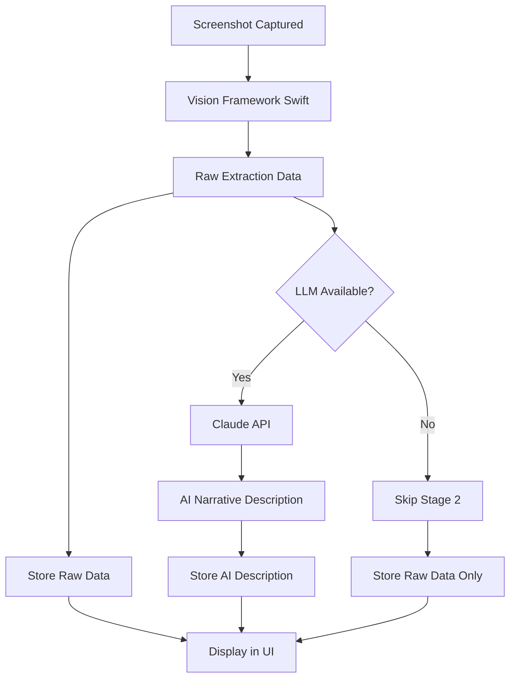

# Screenshot Analysis Architecture

## Overview

TimePortal uses a **two-stage architecture** for screenshot analysis that combines on-device computer vision with cloud-based AI to provide comprehensive, privacy-respecting analysis.

## Why Two-Stage Architecture?

### The Problem with Single-Stage Approaches

Previously, we tried using Apple Vision Framework alone to both extract data AND generate descriptions. This failed because:

- **Vision Framework is excellent at extraction** (OCR, object detection)
- **Vision Framework is poor at narrative generation** (creating coherent descriptions)
- Result: Low-quality, robotic descriptions that didn't capture the true context

### The Solution: Separation of Concerns

By splitting the work between two specialized systems, we get the best of both worlds:

1. **Stage 1 (Vision Framework)**: Extract raw data with high accuracy
2. **Stage 2 (LLM)**: Interpret the data to create meaningful narratives

## Architecture Details

### Stage 1: Vision Framework Extraction (Swift)

**Location**: `/native/screenshot-analyzer/main.swift`

**What it does**:
- OCR text recognition (all visible text in the screenshot)
- Object classification (UI elements, visual objects)
- Structured extraction:
  - Filenames and file paths
  - Code snippets
  - URLs
  - Terminal commands
  - Error messages
  - Project identifiers (JIRA keys, etc.)
  - Technologies detected (React, TypeScript, etc.)
  - Activities detected (Coding, Debugging, Testing)

**What it returns**:
```typescript
{
  success: true,
  confidence: 0.85,
  detectedText: ["App.tsx", "function handleClick...", ...],
  objects: ["computer screen", "text", "document", ...],
  extraction: {
    extractedText: {
      filenames: [...],
      code: [...],
      urls: [...],
      commands: [...],
      errors: [...],
      ...
    },
    visualContext: { application: "Cursor", ... },
    fileContext: { filename: "App.tsx", language: "TypeScript React" },
    projectContext: { projectName: "TimePortal", ... },
    detectedTechnologies: ["React", "TypeScript", "Electron"],
    detectedActivities: ["Coding", "Debugging"]
  }
}
```

**Key principle**: Extract everything, categorize nothing. Leave interpretation to Stage 2.

### Stage 2: LLM Interpretation (Claude)

**Location**: `/electron/llmDescriptionService.ts`

**What it does**:
- Takes the raw Vision Framework output
- Constructs a detailed prompt with all extracted data
- Asks Claude AI to generate a 2-4 sentence narrative description
- Focuses on WHAT the developer was doing, not HOW the data was extracted

**What it returns**:
```typescript
{
  success: true,
  description: "Worked on the TimePortal application implementing a two-stage screenshot analysis architecture in the electron directory. The development focused on integrating Claude AI for generating narrative descriptions from Vision Framework data. Used Cursor editor with TypeScript, debugging integration issues between the Swift analyzer and the Electron main process.",
  model: "claude-3-5-sonnet-20241022",
  tokensUsed: {
    input: 1250,
    output: 89
  }
}
```

**Key principle**: Understand context, generate narrative, be concise.

## Data Flow



## UI Display

The ScreenshotGallery component shows both stages separately:

### AI Narrative (Prominent)
- **Label**: "AI Narrative" with "Claude AI" badge
- **Color**: Purple theme
- **Content**: The LLM-generated description
- **Fallback**: Warning message if API key not configured

### Raw Vision Data (Collapsible)
- **Label**: "Raw Vision Framework Data" with "Stage 1: Extraction" badge
- **Color**: Green theme
- **Content**:
  - Confidence score
  - All OCR text (numbered list)
  - Detected objects (tags)
  - Full structured extraction (JSON)

## Configuration

### Environment Setup

1. **Copy the example environment file**:
   ```bash
   cp .env.example .env.local
   ```

2. **Get your Anthropic API key**:
   - Visit https://console.anthropic.com/settings/keys
   - Create a new API key
   - Copy it to your clipboard

3. **Configure the API key**:
   ```bash
   # Edit .env.local
   ANTHROPIC_API_KEY=sk-ant-api03-your-key-here
   ```

4. **Build the Swift analyzer** (if not already built):
   ```bash
   cd native/screenshot-analyzer
   ./build.sh
   ```

5. **Install dependencies** (includes @anthropic-ai/sdk):
   ```bash
   npm install
   ```

### Running Without LLM (Stage 1 Only)

If you don't configure `ANTHROPIC_API_KEY`:
- Vision Framework extraction still works perfectly (Stage 1)
- Raw data will be available in the UI
- AI narrative descriptions will show a warning message
- The app remains fully functional for time tracking

This is useful for:
- Privacy-conscious users who want on-device processing only
- Development/testing without API costs
- Environments without internet access

## Cost Considerations

### API Usage

Each screenshot analysis costs approximately:
- **Input tokens**: ~1000-2000 (depending on amount of extracted text)
- **Output tokens**: ~80-150 (for a 2-4 sentence description)
- **Cost per screenshot**: ~$0.003-$0.008 USD

With Claude 3.5 Sonnet pricing (as of 2024):
- Input: $3 per million tokens
- Output: $15 per million tokens

### Example Monthly Costs

If you capture 100 screenshots per day (workday):
- **Daily cost**: ~$0.30-$0.80
- **Monthly cost (20 workdays)**: ~$6-$16

**Cost optimization tips**:
- Stage 1 (Vision Framework) is free and runs locally
- Only pay for Stage 2 (Claude) when you need narrative descriptions
- Consider batching or selective analysis for cost control

## Privacy & Security

### On-Device Processing (Stage 1)
- Vision Framework runs entirely on your Mac
- No data leaves your device during extraction
- Screenshots are encrypted at rest

### Cloud Processing (Stage 2)
- Only the raw extraction data is sent to Claude API (not the screenshot image)
- Anthropic's data usage policy: https://www.anthropic.com/legal/privacy
- API requests are made over HTTPS

### Your API Key
- Stored in `.env.local` (gitignored)
- Never committed to version control
- Read only by the Electron main process (not the renderer)

## Troubleshooting

### "LLM service not available" error

**Cause**: `ANTHROPIC_API_KEY` not found in environment

**Solution**:
1. Make sure you created `.env.local` (not just `.env.example`)
2. Verify the API key is correctly set
3. Restart the Electron app to reload environment variables

### LLM description is generic or incorrect

**Cause**: Vision Framework extraction may have missed key context

**Solution**:
1. Check the raw Vision data (collapsible section)
2. Verify OCR text was extracted correctly
3. If Vision extraction is poor, the LLM can't generate good descriptions
4. Consider retaking the screenshot with better visibility

### Vision Framework extraction failed

**Cause**: Screenshot file not found or corrupted

**Solution**:
1. Check the screenshots directory: `~/Library/Application Support/time-portal/screenshots`
2. Verify file exists and is readable
3. Check console logs for Swift analyzer errors

### Build errors with @anthropic-ai/sdk

**Cause**: Dependency not installed or version mismatch

**Solution**:
```bash
# Remove node_modules and reinstall
rm -rf node_modules package-lock.json
npm install
```

## Future Enhancements

### Potential Improvements
- [ ] Batch processing for cost optimization
- [ ] Local LLM support (Ollama, LM Studio) for offline use
- [ ] Customizable prompts for different use cases
- [ ] Quality scoring and confidence thresholds
- [ ] Multi-language support
- [ ] Vision Framework improvements (more extraction categories)

### Alternative LLMs
The architecture is designed to be LLM-agnostic. You could swap Claude for:
- OpenAI GPT-4
- Google Gemini
- Local models (Llama, Mistral via Ollama)

To implement:
1. Create a new service (e.g., `openaiDescriptionService.ts`)
2. Implement the same interface as `llmDescriptionService.ts`
3. Update the import in `main.ts`

## Development

### Testing the Two-Stage Flow

1. **Test Stage 1 only**:
   ```bash
   # Remove or comment out ANTHROPIC_API_KEY in .env.local
   npm run dev:electron
   # Capture screenshots - verify raw data appears in UI
   ```

2. **Test Stage 2 integration**:
   ```bash
   # Add valid ANTHROPIC_API_KEY to .env.local
   npm run dev:electron
   # Capture screenshots - verify AI descriptions appear
   # Check console logs for token usage
   ```

3. **Test error handling**:
   ```bash
   # Use invalid API key
   ANTHROPIC_API_KEY=invalid-key npm run dev:electron
   # Verify error message appears in UI
   ```

### Monitoring LLM Performance

Check console logs for:
- `[LLM Service] Description generated successfully`
- Token usage: `Input: X, Output: Y`
- Prompt length (should be reasonable, not excessive)
- Generation time (usually 1-3 seconds)

### Debugging Vision Extraction

The Swift analyzer logs to stderr:
```bash
# Run analyzer directly for debugging
cd native/screenshot-analyzer
echo '{"imagePath":"/path/to/screenshot.png"}' | ./build/screenshot-analyzer
```

## References

- [Apple Vision Framework](https://developer.apple.com/documentation/vision)
- [Anthropic Claude API](https://docs.anthropic.com/en/api/getting-started)
- [Anthropic Pricing](https://www.anthropic.com/pricing)
